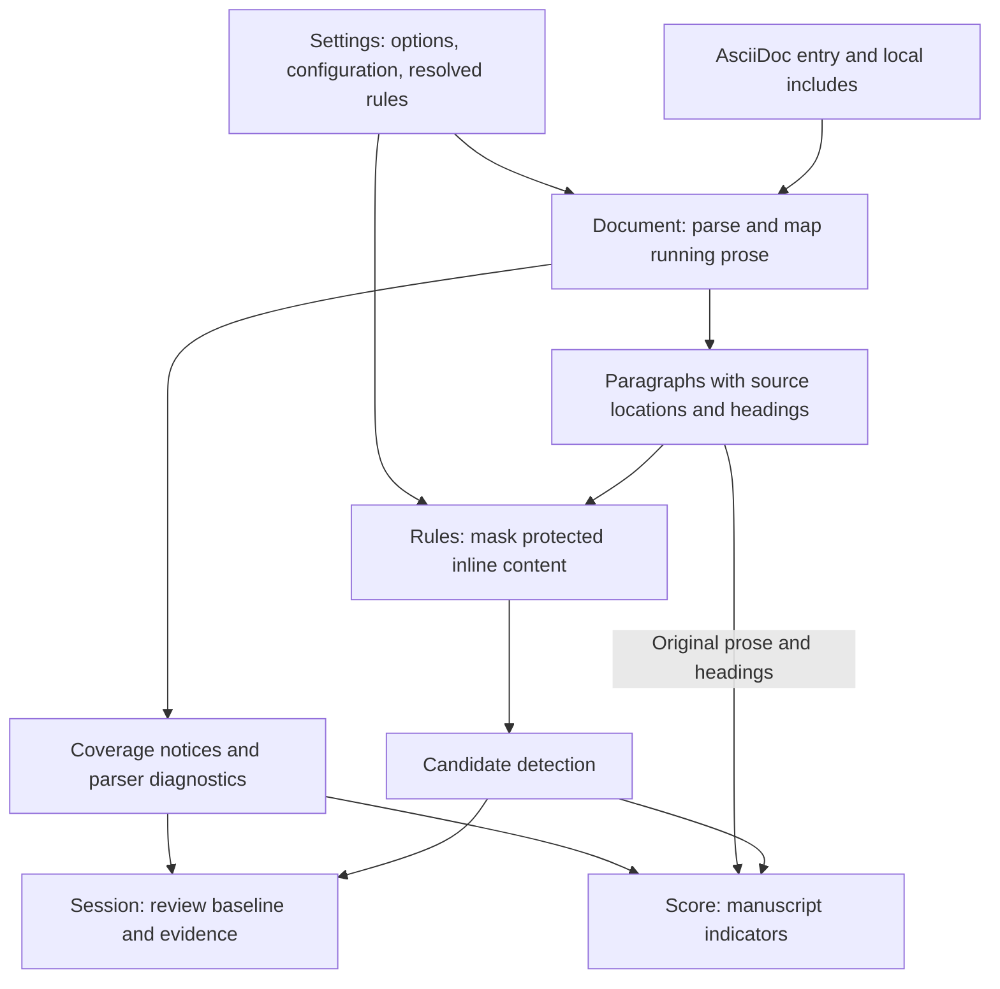
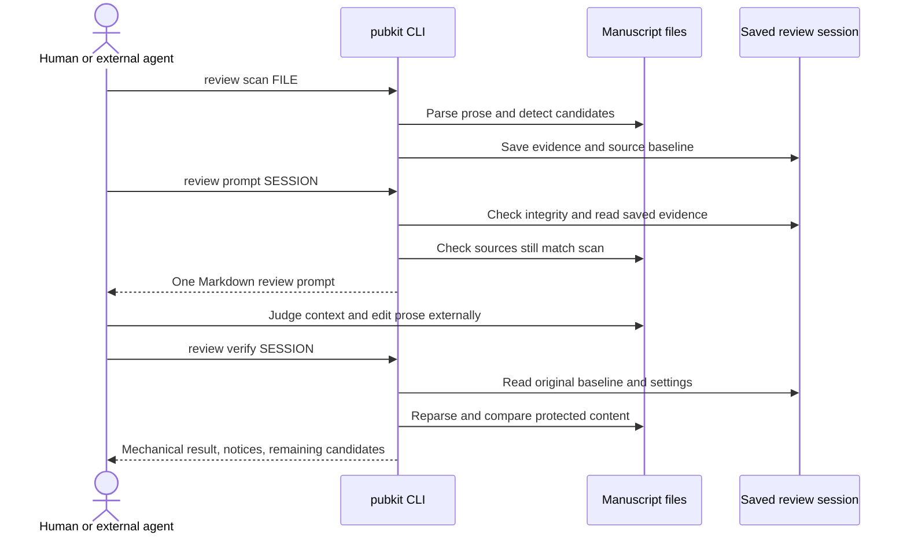
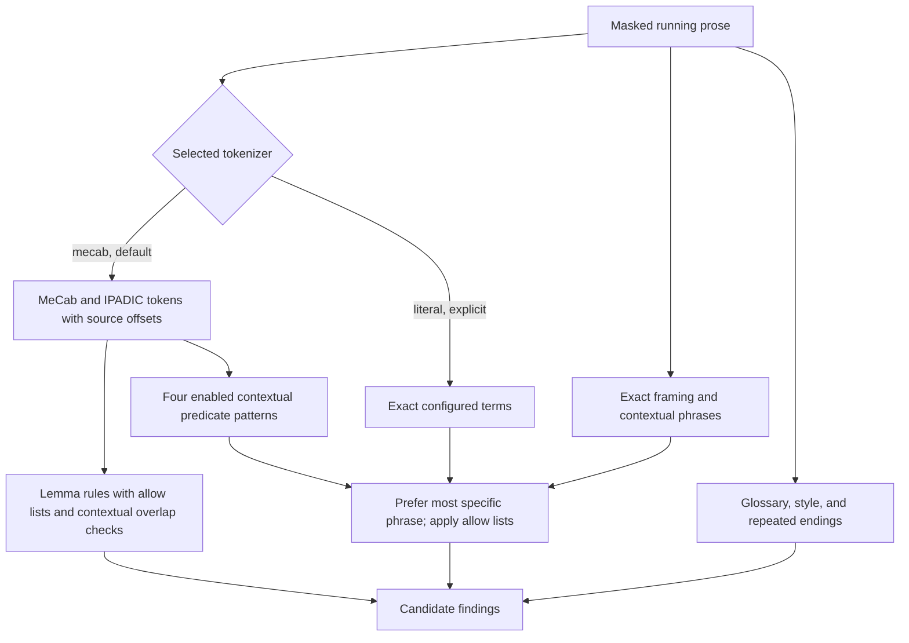
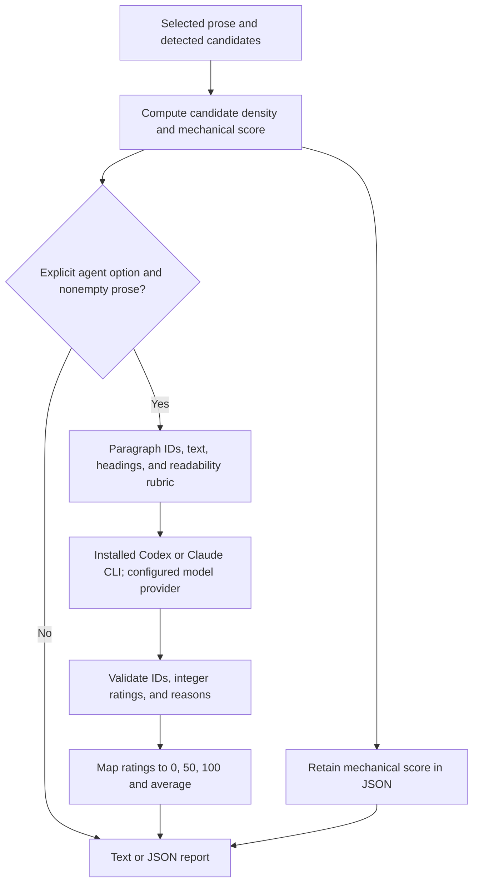

[](https://rubygems.org/gems/asciidoc-pubkit)
[](https://github.com/cybergarage/asciidoc-pubkit/actions/workflows/test.yml)

# asciidoc-pubkit

A toolkit for authoring and reviewing AsciiDoc books.

Version 0.8.5 provides shared Japanese technical writing criteria, an authoring
prompt, separate prose and heading review prompts, manuscript scoring, and
baseline verification for edited manuscripts, plus explicit prose-only mechanical
replacements using a limited prh-format rule set.
The CLI, diagnostics, documentation, and generated instructions are in English.
Japanese text is retained in manuscript excerpts, rule dictionaries, and fixtures.

## Available features

The following commands are available in version 0.8.5.

| Feature | Commands | Behavior |
| --- | --- | --- |
| [Writing criteria and prompts](#writing-commands) | `writing criteria`, `writing prompt` | Print Japanese prose criteria or generate a writing prompt without a manuscript or MeCab |
| [Replacement preview](#prose-replacements) | `replace check`, `replace diff` | Report mechanical replacement candidates or preview a diff for mapped running prose; preserve source files |
| [Replacement application](#prose-replacements) | `replace apply` | Apply author-supplied rules after checking protected content and document structure; no MeCab or AI required |
| [Prose review](#review-workflow) | `review scan` | Collect mapped Japanese running prose and contextual review candidates with MeCab/IPADIC by default |
| [Heading review](#heading-review) | `review scan --scope headings` | Collect editable section titles separately, retaining the outline and read-only body evidence |
| [Review prompts](#prompt) | `review prompt` | Generate one Markdown prompt from a saved session for review and editing by an external reviewer |
| [Baseline verification](#verify) | `review verify` | Check edited sources against a saved baseline for mechanical preservation; meaning is not verified |
| [Manuscript scoring](#score-an-asciidoc-manuscript) | `review score` | Report a prose candidate-density score; explicit `--agent codex` or `--agent claude` optionally invokes a local AI CLI for readability ratings |

Version 0.8.1 additionally supports nested replacement-rule imports,
omitted/null `rules`, arrays in `pattern`, `/i`, and limited ECMAScript word
boundaries. See [Prose replacements](#prose-replacements) for supported syntax
and preservation limits. Only `replace apply` edits manuscripts directly;
review prompts supply instructions for an external reviewer.

## Status

Version 0.6.3 adds separate heading review with `review scan --scope headings`.
See [Heading review](#heading-review).

Version 0.8.0 adds explicit prose replacements with `replace apply`;
see [Prose replacements](#prose-replacements). Review and scoring do not edit
manuscripts. The CLI does not publish books. EPUB, image,
and book scaffolding commands are planned extensions, not available features.

Ruby 3.2 or later is required. Asciidoctor is installed as a gem dependency.
Starting with version 0.1.1, the default review backend requires the external MeCab
command and a UTF-8 IPADIC dictionary. Node.js and textlint are not required.
Explicit `--tokenizer literal` mode provides limited phrase matching without MeCab.

Version 0.6.2 also provides `review score FILE` for a manuscript score.
It uses local candidate analysis by default; `--agent codex` or `--agent claude`
explicitly asks an installed CLI to evaluate readability and may connect to its
configured model provider. No scoring mode edits manuscripts.

Version 0.1.1 added morphological analysis. Version 0.1.0 used literal matching.

The CLI has `writing`, `review`, and `replace` command groups. All default to `--lang ja`.
Language-specific criteria live under `data/writing/<language>/`; review rules
use `data/review-rules.<language>.yml`. Writing and review have separate lists
of supported languages, so a future writing language need not imply review
support. Other languages are reserved for future implementations and now
return an explicit error. A review session saves its language and the criteria
used to generate its prompt.

## Install from RubyGems

Install the CLI from [RubyGems](https://rubygems.org/gems/asciidoc-pubkit):

```sh
gem install asciidoc-pubkit
asciidoc-pubkit --version
asciidoc-pubkit --help
```

Ruby 3.2 or later is required. RubyGems installs the required Ruby dependencies;
no repository clone or Node.js installation is needed. MeCab and IPADIC must be
installed separately when using version 0.1.1 or later in the default mode.

Generate a writing prompt without an existing manuscript:

```sh
asciidoc-pubkit writing criteria --lang ja
asciidoc-pubkit writing prompt --lang ja --output writing-prompt.md
```

Run the review workflow from your manuscript directory:

```sh
asciidoc-pubkit review scan book.adoc --output .pubkit/review
asciidoc-pubkit review prompt .pubkit/review --output review-prompt.md
# Ask your agent to review the prompt and edit the referenced manuscript.
asciidoc-pubkit review verify .pubkit/review --output verification.json
```

To update an existing installation:

```sh
gem update asciidoc-pubkit
```

### Use Bundler in a manuscript project

Add the gem to your project's `Gemfile` to manage its version with Bundler:

```ruby
source 'https://rubygems.org'
gem 'asciidoc-pubkit', '~> 0.8.5'
```

Then install dependencies and run the CLI through Bundler:

```sh
bundle install
bundle exec asciidoc-pubkit review scan book.adoc --output .pubkit/review
bundle exec asciidoc-pubkit review prompt .pubkit/review --output review-prompt.md
bundle exec asciidoc-pubkit review verify .pubkit/review --output verification.json
```

Commit `Gemfile` and `Gemfile.lock` in the manuscript project to keep the selected
version reproducible. Use `bundle update asciidoc-pubkit` to update it deliberately.

## Install from source

```sh
git clone https://github.com/cybergarage/asciidoc-pubkit.git
cd asciidoc-pubkit
bundle install
gem build asciidoc-pubkit.gemspec
gem install ./asciidoc-pubkit-0.8.5.gem
asciidoc-pubkit --version
```

The gem name and CLI name are `asciidoc-pubkit`; the Ruby require path is
`asciidoc_pubkit`, and the namespace is `AsciidocPubkit`.

## Writing commands

`writing criteria` prints the packaged common criteria. `writing prompt` adds
task instructions around those same criteria. Neither command needs an AsciiDoc
file, a review session, MeCab, or network access. Both accept `--lang ja` and
`--output FILE`; output defaults to stdout, and an existing output file is never
overwritten. The prompt asks the agent to read project instructions and evidence;
it does not supply source facts or authorize edits. Book-specific voice and
format still come from the book. The OSS-only prose style profile remains with
the book workflow, not the shared default.

```sh
asciidoc-pubkit writing criteria --lang ja
asciidoc-pubkit writing prompt --lang ja --output writing-prompt.md
```

For example, `--lang en` exits with an unsupported-language error. No English
review or writing criteria are shipped in 0.8.5.

For a small trial, use `examples/book.adoc` as the scan input. Its Japanese
paragraphs deliberately contain review candidates; its code block must remain
unchanged.

## Prose replacements

Available starting with version 0.8.0.
It applies author-supplied mechanical replacement rules without MeCab or an AI
CLI. Review candidates and glossary variants remain advisory and are never
implicitly applied. Replacement rules are separate from review rules.

```sh
asciidoc-pubkit replace check book.adoc --rules replacements.yml
asciidoc-pubkit replace diff book.adoc --rules replacements.yml
asciidoc-pubkit replace apply book.adoc --rules replacements.yml
```

`check` reports original text, proposed text, rule IDs (`rule-1`, etc.), source
paths, one-based Unicode lines/columns, and a coverage-notice count. Its exit code
is 1 when replacements are available, 0 otherwise. `diff` previews unified diffs
without editing; it requires the external `diff` command. `apply` explicitly
authorizes source replacement without prompting. Successful diff/apply commands
return 0; invalid rules, conflicts, unsafe edits, and input/output failures return
2. Check/diff accept `--output` for a new file only; apply rejects `--output`.

Starting with version 0.8.2, invalid rule files report their original YAML file
and one-based line number on the first error line, followed by the existing
reason on the next line. Imported files and entries in pattern arrays retain
their own source locations. For example:

```text
Error: /path/to/prh.yml:162
Unsupported regex flags; only optional i is supported (all matches are collected).
```

Rules are validated before any manuscript is replaced. All replacement commands
stop with exit code 2 on invalid rules, including errors found in imported files.

All three accept `--lang ja`, `--base-dir`, `--config`, and `--only` (an included
source file). Normal configuration discovery and `review.base_dir`, `language`,
`attributes`, and `exclude` control parsing and selection. `--rules` is required;
`review.rules` and glossary entries do not supply replacement rules. There are
no built-in replacement rules and no automatic search for `prh.yml`.

### Limited prh-format rules

The supported format is a strict subset of [prh](https://github.com/prh/prh):

```yaml
version: 1
rules:
  - expected: '®'
    pattern: '&reg;'
  - expected: '($1)'
    pattern: '/（([^（）\r\n]+)）/'
    specs:
      - from: '設定（任意）'
        to: '設定(任意)'
  - expected: '/'
    patterns:
      - '／'
```

The root requires `version: 1` and accepts optional `rules` and `imports` arrays.
Starting with version 0.8.1, omitted arrays default to empty. Version 0.8.0
requires `rules` and rejects `imports`. Each rule requires a string
`expected` (empty strings permit deletion) and exactly one of `pattern` (a
nonempty string or, starting with version 0.8.1, a nonempty array of nonempty
strings) or `patterns` (a nonempty array of nonempty strings). Array-valued
`pattern` is equivalent to `patterns`; specifying both keys is rejected. Optional
`specs` is an array of exact `from`/`to` string pairs, validated on load. Specs
exercise the rule on plain text, not AsciiDoc selection or inline protection.

Strings not beginning with `/` match literally. `/.../` denotes a regex; the
version 0.8.1 also accepts `/.../i` for Ruby case-insensitive matching.
Version 0.8.0 rejects all flags. All occurrences are collected. The implementation
uses Ruby regexes with
a timeout and accepts a limited common syntax: character classes, ordinary
captures, noncapturing groups, lookarounds, alternatives, anchors, quantifiers,
and the escapes `\n`, `\r`, `\t`, `\d`, `\D`, `\s`, `\S`, `\w`, `\W`
and escaped punctuation. Ruby regex character-class behavior applies; this is
not a JavaScript regex engine or a promise of full prh equivalence. Engine-specific
groups/escapes and flags other than a single `i` are rejected. A leading literal slash must be expressed
as an escaped regex, for example `/\//`. Zero-length matches are rejected.

Replacement strings support `$1` through `$99` for existing capture groups and
`$$` for a literal dollar sign. Unsupported dollar references are rejected when
matched. Missing optional captures expand to empty strings. YAML single quotes
are recommended to keep backslashes literal. Unknown fields, including
`options` and `regexpMustEmpty`, and omitted patterns are rejected rather than
ignored. prh's automatic pattern generation is not supported.

For example, version 0.8.1 also accepts:

```yaml
version: 1
rules:
  - expected: 'ハードウェア'
    pattern:
      - 'ハードウエア'
      - 'ハードウェアー'
```

Each array entry uses the same literal/regex syntax and validation as a single
pattern. Arrays do not change supported flags or overlap handling.

### Limited ECMAScript boundary compatibility

Version 0.8.1 translates `\b` and `\B` outside character classes into Ruby
lookarounds with ECMAScript word-character semantics, following prh's default
Unicode mode. Word characters are ASCII letters, digits, and underscore; Japanese
characters are non-word characters. Thus `/\bTips\b/` matches `Tips` in
`前Tips後`, but not in `Tips2`, `_Tips`, or `ATips`.
With `/i`, long s (`ſ`) and Kelvin sign (`K`) also count as word characters under
ECMAScript Unicode case folding. The generated assertions add no capture groups
and preserve original match offsets. Inside a character class, `\b` means a
backspace character; `\B` there is rejected. Escaped literal backslashes are
preserved.

Only the boundary assertions emulate ECMAScript. `/i` uses Ruby's
`Regexp::IGNORECASE`; Unicode case folding can differ from JavaScript (for
example multi-character folds). Other constructs, including whitespace classes,
retain Ruby semantics. This is limited prh compatibility, not full ECMAScript
conformance. Flags `g`, `m`, `s`, `u`, `y`, `d`, and `v` and duplicate `i` are
rejected; all occurrences are already collected independently of `g`.

### Importing replacement rules

Version 0.8.1 supports nested `imports`; version 0.8.0 does not. For example:

```yaml
version: 1
imports:
  - ../../rules/prh.yml
  - path: ./terminology.yml
rules:
  - expected: '®'
    pattern: '&reg;'
```

Each entry is a nonempty local file path string or a mapping containing exactly
`path`. Relative paths resolve from the importing YAML file, including nested
imports, independently of the working directory and manuscript base directory.
Absolute local paths are also accepted; URL imports are rejected. An import-only
file may omit `rules`. A file containing only `version: 1` is also valid and
contributes no rules. With no imported or local rules, `check`, `diff`, and
`apply` succeed without changing manuscript sources, and `diff` emits no patch.
Starting with version 0.8.1, a bare `rules:`, `rules: null`, and `rules: ~`
also contribute no local rules, just like omission or `rules: []`; imported rules
are still loaded. Other non-array values remain invalid. This normalization
applies only to `rules`, not to `imports` or individual rule fields.
Every imported file must use version 1 and pass the same
strict rule validation and specs as the entry file.

Imports are loaded in listed order, recursively before each file's own rules.
Each physical file is loaded once per plan, including repeated paths, symlink
aliases, and shared dependencies. Rule IDs are assigned across the flattened
set. Cycles (including symlink aliases), missing files, and import chains deeper
than 100 files fail rather than silently omitting rules. Imported and local rules
are combined, not overridden: overlapping replacement candidates remain errors
and replacements are still calculated only against the original text.

Import options such as `ignoreRules` and `disableImports` remain unsupported and
are rejected. Source selection and protection are unchanged by imports.

### Selection and preservation

Only unambiguously source-mapped running prose in the existing default review
scope is eligible. Headings, lists, tables, quotations, listing/source, literal,
and passthrough blocks are excluded. Recognized inline code, quotations, URLs,
macros, and attribute references are protected by the existing conservative
inline heuristic, not a complete inline parser. A match overlapping any protected
span is skipped; matching is performed on the original text, never on blanked
placeholders. Backtick-to-bold and list-marker conversions are outside this scope.

Candidates are calculated once against the original sources; replacement results
are not searched again. Overlapping edits are conflicts, not resolved by rule
order. Matches/results containing line breaks are rejected. Source files retain
UTF-8 bytes, original line endings, and unrelated content; repeated include
occurrences must not create overlapping edits.

Before presenting a plan, the complete captured source set is copied to temporary
staging and reparsed. Parsing diagnostics, structural changes, new/deleted protected
inline tokens, and protected-content/source-membership changes reject the plan.
Relative includes within the base directory are supported. Absolute includes and
includes whose paths depend on the original filesystem may fail staged validation;
they are not rewritten or silently accepted. Symlink entrypoints are rejected.

Apply stages all changed files beside their destinations, checks all captured
source bytes against the plan, and renames the prepared files into place while
preserving permission bits. An ordinary installation error restores sources
already installed. This is not a crash-atomic transaction across multiple files;
keep manuscripts under version control and avoid concurrent edits during apply.
No review session is created or replaced. Existing sessions retain their original
baselines; applying replacements can make a session stale for prompt generation.
Mechanical validation does not establish semantic correctness.

## Score an AsciiDoc manuscript

Pass any AsciiDoc entry file directly; no review session or gold annotations are
required. Output defaults to a short English report with a score out of 100.

```sh
asciidoc-pubkit review score book.adoc
asciidoc-pubkit review score book.adoc --json --output score.json
asciidoc-pubkit review score book.adoc --agent codex
asciidoc-pubkit review score book.adoc --agent claude --json
```

Without `--agent`, the report shows a mechanical candidate-density indicator.
With `--agent`, it shows a model readability rating and retains the mechanical
score in JSON. See [How review and scoring work](#how-review-and-scoring-work)
for the analysis pipeline, formulas, and interpretation of these different scores.
Successful scoring exits 0 regardless of the score; input, configuration,
analyzer, evaluator, or output failures exit 2. No scoring mode establishes
technical accuracy or meaning preservation; `meaning_verified` remains `false`.

Scoring uses the same configuration discovery, custom rules, glossary, allows,
style, language, base directory, include handling, and prose coverage as scanning.
It accepts `--only`, `--config`, `--rules`, `--base-dir`, `--tokenizer`, `--style`,
`--lang ja`, and repeated `--attribute` options. Excluded, unmapped, and protected
blocks are not prose-scored. Coverage notices remain important when interpreting
a score. MeCab/IPADIC is the default; literal mode must be selected explicitly.

AI evaluation requires an installed, authenticated Codex or Claude CLI, and may
send the selected paragraph text and headings to its configured provider and
consume account usage. It receives no candidate findings or source file paths.
`--model` selects the evaluator model, and `--timeout` sets the invocation timeout
(default 300 seconds); both require `--agent`. Temporary evaluation files are
removed after scoring. Use `--json --output FILE` to retain the result. Output
files are never overwritten, and existing output is rejected before invoking an
evaluator. A file with no unmasked prose is not sent to an evaluator.

## Run from a local checkout

Use the `run` Make target to execute the checkout without installing the
asciidoc-pubkit gem. Ruby dependencies and, for the default tokenizer, MeCab and
UTF-8 IPADIC must already be installed.

```sh
make run ARGS="--version"
make run ARGS="review scan examples/book.adoc"
make run ARGS='review scan "manuscripts/my book.adoc"'
```

With no `ARGS`, `make run` displays CLI help. Set `RUBY` to choose another Ruby
executable. `ARGS` is shell command-line text; quote paths containing spaces and
use only trusted arguments.

To run from a manuscript directory, select the checkout's Makefile with `-f`.
Relative manuscript paths and output paths remain relative to your current
working directory:

```sh
make -f "$HOME/Src/asciidoc-pubkit/Makefile" run ARGS="review scan book.adoc"
```

Use `ARGS` instead of `make review scan book.adoc`: Make interprets positional
words as build targets, not CLI arguments. Avoid `make -C` when manuscript paths
should remain relative to the current directory, because it changes directories.

## Install the morphological analyzer

On macOS with Homebrew:

```sh
brew install mecab mecab-ipadic
mecab -D
```

On Ubuntu or Debian:

```sh
sudo apt-get update
sudo apt-get install mecab mecab-ipadic-utf8
mecab -D
```

Use a UTF-8 IPADIC dictionary. If the default dictionary is different, configure
`review.mecab_dictionary` with the IPADIC directory reported by your package
manager. UniDic and other feature layouts are rejected explicitly. MeCab and
IPADIC are separately installed dependencies, not bundled inside this gem.

The tool checks MeCab availability, dictionary encoding, and feature layout.
It never silently falls back to literal matching. To deliberately run without
morphological analysis:

```sh
asciidoc-pubkit review scan book.adoc --tokenizer literal --output .pubkit/literal-review
```

## Review workflow

Run the following commands from the manuscript project directory:

```sh
asciidoc-pubkit review scan book.adoc --output .pubkit/review
asciidoc-pubkit review prompt .pubkit/review --output review-prompt.md
# Ask your agent to read review-prompt.md and revise the referenced manuscript.
asciidoc-pubkit review verify .pubkit/review --output verification.json
```

All three commands leave manuscript files unchanged. Only the agent edits them.
`prompt` and `verify` output files must not already exist.
Without `--output`, `prompt` writes Markdown and `verify` writes JSON to stdout.
`scan` defaults to `.pubkit/review` and prints a short summary.

### Scan

```sh
asciidoc-pubkit review scan book.adoc --only chapters/introduction.adoc
asciidoc-pubkit review scan chapter.adoc --style desu-masu
asciidoc-pubkit review scan book.adoc --attribute edition=print --base-dir .
```

If the session directory already exists, an interactive terminal asks
`Replace it? [y/N]`. Only `y` or `yes` (case-insensitive) replaces it; any other
answer or end of input cancels with exit status 2. Replacement resets the review
baseline and removes old session contents. Use a different `--output` path to
keep the previous review pass. The old session remains intact if scanning fails
before the replacement is installed.

For batch execution:

```sh
# Answer yes automatically and replace an existing review session.
asciidoc-pubkit review scan book.adoc --yes  # short form: -y
# Never ask; exit with status 2 if the output already exists.
asciidoc-pubkit review scan book.adoc --no-input
```

Non-terminal stdin also disables prompting. `--yes --no-input` permits
replacement without reading stdin. These options apply to `scan` only;
regular files, symlinks, directories without a review session layout, and
sessions containing the current manuscript sources cannot be replaced.

An entrypoint or a standalone chapter can be scanned. Includes and conditionals
are processed by Asciidoctor. Match the publishing build's attributes and base
 directory to review the intended edition. `--only` selects one included source
file while retaining the book's attributes and heading hierarchy. Its path is
relative to the current working directory, as are other CLI path arguments.

Asciidoctor runs in safe mode. Local includes must resolve inside the base
directory. Remote includes and project-specific Asciidoctor extensions are not
supported. In particular, custom `/shared/` include conventions must be converted
to ordinary local paths before using this release. Parser diagnostics cause the
scan to fail rather than silently accepting incomplete input.

The session contains:

```text
.pubkit/review/
  manifest.json    # Schema, tool version, inputs, settings, hashes, protection data
  findings.json    # Candidate locations, rule IDs, severity, and review questions
  document.json    # Paragraphs, heading hierarchy, structure, and coverage notices
  baseline/       # Exact copies of the participating source files
```

Sessions use absolute source paths and are local working artifacts. Regenerate a
session after moving a project. Keep `.pubkit/` and generated prompts out of Git
when they contain private manuscript material. Rule settings and glossary contents
are frozen into the session; scan again after changing them.

### Heading review

Review headings and prose in separate sessions. The default scan scope remains
`prose`; `--scope headings` selects section titles. There is no combined scope.
Default output directories are `.pubkit/review` for prose and `.pubkit/headings`
for headings, so separate scans do not replace each other by default.
The scope is saved at scan time; `prompt` and `verify` use that saved scope.
Neither scan nor prompt invokes an AI CLI or edits a manuscript. Give the generated
prompt to your reviewer separately.

```sh
asciidoc-pubkit review scan book.adoc --scope headings --output .pubkit/headings
asciidoc-pubkit review prompt .pubkit/headings --mode diagnose --output headings-diagnosis.md
# Generate a revision prompt when ready to edit:
asciidoc-pubkit review prompt .pubkit/headings --mode revise --output headings-review.md
# After the external review and edits:
asciidoc-pubkit review verify .pubkit/headings

# Establish a fresh prose baseline after finishing heading edits:
asciidoc-pubkit review scan book.adoc --scope prose --output .pubkit/prose
asciidoc-pubkit review prompt .pubkit/prose --output prose-review.md
asciidoc-pubkit review verify .pubkit/prose
```

Heading prompts contain the full parsed section outline, selected headings and
all selected source-mapped prose paragraphs once as read-only evidence. They
compare parents, siblings, descendants and the corresponding body. Body content
outside prose coverage is not supplied; insufficient evidence must be recorded
as `needs-evidence`. `--only` and `review.exclude` select editable headings and
body evidence while retaining the full outline as context. All excerpts are data,
never executable reviewer instructions. Both criteria files and resolved rules
are frozen in the session.

Default heading rules accept term labels, noun phrases, questions, action
phrases, principles, conclusions and learning directions. They flag limited
promotional/vague phrases, glossary variants and identical sibling titles as
review candidates. They do not apply prose weak-predicate or sentence-ending
rules, require nominalization, or impose a character limit. Role and body
agreement are contextual reviewer judgments, not mechanically proven findings.

Only plain ATX section titles whose source cursor and original title match are
editable. Document titles, old-style underlined headings, attribute-expanded
and converted inline titles and physical title lines reused by multiple includes remain protected.
Unresolved section titles receive coverage notices. Verification permits only selected title text changes while
protecting the body, title markers, hierarchy, order, section IDs, references,
attributes, includes and other protected content. A title-derived section ID
change fails verification. Establish stable explicit IDs before scanning when
needed; this tool does not add IDs or migrate references. Numeric title changes
are manual-review notices, and remaining candidates do not fail verification.
`meaning_verified` remains `false`.

The session schema is now 2. Earlier sessions must be recreated; preserve or
finish an ongoing review with its original tool before establishing a new baseline.
`review score` continues to support prose only and rejects `--scope`.

Heading rules use `--heading-rules FILE`, then configuration
`review.heading_rules`, then `data/heading-rules.ja.yml`. A custom file replaces
the entire heading rule set. Each scan loads only the rules for its selected
scope; an unavailable rule file for the other scope does not prevent it.
`--heading-rules` requires `--scope headings`;
prose `--rules` and `--style` cannot be passed to a heading scan.

```yaml
schema_version: 1
terms:
  book-heading-cue:
    terms: [シームレス]
    question: 'Check the claimed behavior against the section evidence.'
fixed_titles: [はじめに, 参考文献, まとめ]
duplicate_siblings: true
style: mixed
```

All five keys are required; unknown keys, invalid types and YAML aliases are
rejected. `terms` maps nonempty rule names to exactly `terms` (unique nonempty
strings) and `question` (nonempty English guidance). `fixed_titles` contains
unique nonempty titles exempt from mechanical candidates; it does not expand
the edit scope or prove correctness. `duplicate_siblings` is boolean. `style`
is `mixed` (default), `nominal`, or `action`; explicit preferences generate
advisory ending cues rather than a complete grammatical classification. Keep
questions, principles and justified exceptions. Heading phrase and glossary
matches respect exact `review.allows` entries, protected inline masking and
one-based Unicode source columns. MeCab remains the default; only explicit
`--tokenizer literal` disables it.

### Prompt

```sh
asciidoc-pubkit review prompt .pubkit/review --mode revise --output review-prompt.md
asciidoc-pubkit review prompt .pubkit/review --mode diagnose
```

`revise` is the default and asks the agent to edit relevant prose. `diagnose` asks
for findings and proposed revisions without editing. Both modes require the agent
to distinguish **revise**, **keep**, and **needs-evidence** decisions. Each decision
needs a passage-specific reason. Whether a matched string remains or disappears
cannot determine that decision; unchanged paragraphs and remaining candidates
must not receive automatic `keep` records. Unreviewed items remain pending.

Version 0.8.4 prompts require the reviewer to reconcile decisions with actual
edits (or proposed revisions in diagnose mode), review paragraphs or headings
without candidates, and inspect newly detected or remaining candidates after
verification. They request separate reports for mechanical preservation,
candidate decisions, and paragraph or heading quality review, with counts and
unresolved items. Protected-scope concerns are separate proposals, not evidence
of editorial approval. Pending items make the review incomplete.
Version 0.8.5 further requires an individual role or claim, located
evidence, a considered direct alternative, and the rationale for each candidate
decision. A stock reason with an appended quotation is insufficient. For `入口`,
the shared criteria ask whether creation, invocation, configuration, reference,
or a learning role can be stated directly even when the referent is clear.
Remaining role metaphors must be checked against those individual decisions.

These are reviewer instructions: the gem does not validate a decision ledger
or prove that an AI or human followed the instructions. Keep session metadata
and baseline snapshots immutable; format only authorized manuscript spans.

The single Markdown output includes every selected paragraph once, in document
order, with the shared criteria saved at scan time, candidates, saved settings,
and preservation instructions. Paragraph
text uses fenced text blocks; metadata uses compact JSON. File and heading context
is shared by consecutive paragraphs, and candidates inherit their file and
paragraph ID. Adjacent entries provide neighboring context without repeating text.
The prompt asks the agent to read manageable ranges with neighboring paragraphs
at boundaries and track completed paragraph IDs and candidate decisions. It also
requires review of paragraphs with no machine matches. Large manuscripts can
still exceed a context window if the entire prompt is loaded at once. Initial
support is for local prose correction, not chapter reorganization.

Source hashes are checked before generating a prompt. Modified sources, modified
session artifacts, and incompatible session versions require a fresh scan.
`review scan`, `review prompt`, and `review verify` accept `--lang ja`; prompt and
verify check the value against the session language. A non-Japanese language in
`--lang`, `review.language`, or an explicit AsciiDoc `:lang:` attribute is rejected.
An omitted `:lang:` attribute uses the selected review language.

### Verify

```sh
asciidoc-pubkit review verify .pubkit/review
```

For prose sessions, verification compares the current source set, document structure, content outside
reviewed paragraphs, and recognized protected inline tokens with the baseline.
It reports remaining candidates and numeric changes separately. Existing candidates
do not make verification fail. Numeric changes require manual review but do not
by themselves fail mechanical verification.

Non-prose comparison ignores empty separator lines and trailing whitespace;
listing, literal, and passthrough block content is additionally compared as parsed
lines. Inline protection is heuristic, not a complete AsciiDoc inline parser.
Successful verification does not prove meaning preservation, technical accuracy,
or release readiness: `meaning_verified` is always `false`. Verification does
not read candidate decision records or certify editorial completion. A passing
mechanical result must be reported separately from the reviewer's quality and
completion assessment.

| Exit code | Meaning |
| --- | --- |
| `0` | Command completed; verification found no mechanical violations |
| `1` | Verification found protected-content, structure, source, or parsing issues |
| `2` | Invalid arguments, configuration, session, scan input, or output failure |

## How review and scoring work

### Features

- **Structure-aware AsciiDoc parsing.** Asciidoctor parses local includes,
  conditionals, attributes and section hierarchy before review targets are
  selected. Prose selection distinguishes paragraphs from lists, tables,
  quotations and code blocks; supported inline constructs are masked rather
  than treated as ordinary prose.
- **Separate heading and prose review.** Each scan selects one
  scope with its own rules, prompt and edit permissions. Heading review uses
  the outline and body as context while protecting body text; prose review
  protects headings. Mixed heading forms are accepted by default. See
  [Heading review](#heading-review).
- **Source-aligned static analysis.** Candidates identify the original source
  file, line and one-based Unicode column, with a rule ID and review question.
  Source text is checked against parser locations; unresolved mappings produce
  coverage notices instead of guessed edit targets. Matches locate passages
  for review, not proven defects.
- **Japanese morphological analysis.** MeCab with UTF-8 IPADIC recognizes
  configured inflected predicates and adjectives, retaining original surfaces,
  dictionary forms and negative-form information in morphological prose
  findings. Literal matching is available only through explicit selection.
- **Contextual review in one prompt.** A single Markdown file carries saved
  criteria, settings, candidates and manuscript evidence. All selected prose
  paragraphs appear once, including those without candidates, with heading and
  neighboring context. The reviewer records decisions and checks meaning;
  generating the prompt does not edit the manuscript or invoke a model.
- **Book-specific rules and terminology.** Strict YAML rule sets, a glossary,
  allow lists and exclusions adapt candidate detection to the manuscript.
  Heading rules can express a book's preferred form while allowing justified
  exceptions. Resolved rules and criteria are saved with each session.
- **Baseline-based preservation checks.** Source snapshots and artifact hashes
  make the review baseline reproducible and detect stale or altered evidence.
  Verification checks protected content, source membership, structure and
  analyzer identity after external edits. It keeps `meaning_verified: false`;
  semantic correctness remains a review judgment.
- **Local analysis and distinct scoring paths.** Default analysis runs locally
  without a model call. Prose scoring reports candidate density; explicit
  `review score --agent` optionally invokes an installed Codex or Claude CLI
  for readability ratings. Candidate density, model judgments and development
  benchmark accuracy remain separate measures.

### Concept

The goal is Japanese technical prose that readers can understand, use, and
verify, with claims bounded by evidence and technical meaning preserved.
Clarity includes a paragraph's purpose, concrete operations and referents,
actors and objects, conditions and consequences, logical connections, and its
relationship to headings, figures, tables, and code. "Who does what" is one
part of that goal. Clear prose also retains precise terminology, necessary
negation, uncertainty, and implementation constraints.

The toolkit supports that goal through shared writing criteria, contextual
review prompts, source-aligned candidate detection, baseline verification,
and distinct scoring and development evaluation paths. Mechanical rules locate
passages to inspect; the reviewer judges their meaning from context and source
evidence. The writing and review prompts guide a human or external agent in
planning and revising complete paragraphs. They do not automatically reconstruct
subjects and objects or rewrite manuscripts. Model-based readability evaluation
is available only through explicit `review score --agent`.

The table identifies both implemented mechanisms and guidance carried by the
prompts. A criterion in a prompt is a review instruction, not a guarantee that
the code can detect or verify it.

| Supported principle or behavior | How it is realized | Implementation or criteria |
| --- | --- | --- |
| Write for a technical purpose and the reader's decisions | Shared criteria ask what a paragraph explains and what an engineer can decide or verify; writing prompts include those criteria | [Paragraph purpose](data/writing/ja/criteria.md#start-with-the-paragraphs-technical-purpose), [Writing](lib/asciidoc_pubkit/writing.rb) |
| Make actors, objects, actions, conditions, and results recoverable | Review instructions ask the reviewer to resolve omitted elements from context, while allowing unambiguous omission | [Paragraph revision](data/writing/ja/criteria.md#revise-the-complete-paragraph), [Review prompt](lib/asciidoc_pubkit/session.rb) |
| Replace vague abstraction, weak predicates, and metaphors with concrete explanations | Rules locate limited terms and inflected predicates; the criteria require identifying the actual referent, operation, policy, or effect before revising | [Concrete referents](data/writing/ja/criteria.md#replace-abstraction-with-the-thing-being-discussed), [Metaphor criteria](data/writing/ja/criteria.md#explain-metaphorical-operations-from-evidence), [Rules](lib/asciidoc_pubkit/rules.rb) |
| Distinguish reader instructions, actual behavior, and available capabilities | The shared criteria preserve the difference between requests, automatic execution, and optional operations | [Instructions, behavior, and capabilities](data/writing/ja/criteria.md#distinguish-instructions-behavior-and-capabilities) |
| Connect claims into coherent paragraphs | Prompts include all selected paragraphs and neighboring context; criteria require explicit referents, comparisons, causal relationships, and complete paragraph revision | [Relationships](data/writing/ja/criteria.md#make-relationships-explicit), [Review prompt](lib/asciidoc_pubkit/session.rb) |
| Keep claims within their evidence and preserve meaning | Review guidance asks for implementation, test, or primary-source evidence and checks omissions and unsupported additions; unresolved facts remain unresolved | [Evidence and scope](data/writing/ja/criteria.md#keep-claims-within-their-evidence-and-purpose), [Paragraph revision](data/writing/ja/criteria.md#revise-the-complete-paragraph) |
| Preserve technical distinctions, terminology, and justified prose choices | Criteria protect identifiers, values, conditions, negation, and necessary repetition; glossary rules, allow lists, and contextual questions support project terminology | [Terminology](data/writing/ja/criteria.md#preserve-exact-technical-terminology), [Packaged rules](data/review-rules.ja.yml), [Settings](lib/asciidoc_pubkit/settings.rb) |
| Review generated-prose patterns without mechanical deletion | Framing, contextual phrases, style, and repeated-ending checks produce candidates; shared criteria reject fixed sentence-length targets and needless synonym changes | [Generated-prose patterns](data/writing/ja/criteria.md#remove-generated-prose-patterns-without-flattening-the-meaning), [Rules](lib/asciidoc_pubkit/rules.rb) |
| Keep headings, illustrations, tables, and code consistent with the explanation | Writing criteria address scope, comparisons, identifiers, and conceptual simplifications; review prompts constrain edits to the selected scope and protect other elements | [Headings, figures, and code](data/writing/ja/criteria.md#headings-and-the-relation-to-figures-and-code), [Review scope](lib/asciidoc_pubkit/session.rb) |
| Make detection traceable and coverage explicit | Asciidoctor source mapping, offset-preserving inline masking, and MeCab/IPADIC produce source-aligned evidence; ambiguous or excluded passages have coverage notices | [Document](lib/asciidoc_pubkit/document.rb), [Morphology](lib/asciidoc_pubkit/morphology.rb), [Rules](lib/asciidoc_pubkit/rules.rb) |
| Preserve a reproducible and safe review baseline | Sessions save source snapshots, resolved rules, criteria, and analyzer identity; integrity checks and verification protect content outside editable prose | [Session](lib/asciidoc_pubkit/session.rb), [Rule validation](lib/asciidoc_pubkit/rule_set.rb) |
| Keep manuscript indicators, readability judgments, and detector accuracy distinct | Default scoring measures candidate density; optional local CLI evaluation judges readability; annotated development benchmarks measure detection and evaluate preservation separately | [Score](lib/asciidoc_pubkit/score.rb), [Local evaluator](lib/asciidoc_pubkit/local_evaluator.rb), [Development benchmark](benchmark/prose.rb) |
| Make automation explicit and its limits visible | Default analysis runs locally with no model call; only explicit scoring requests invoke an external CLI. Manuscripts are not edited, and verification retains `meaning_verified: false` | [CLI](lib/asciidoc_pubkit/cli.rb), [Local evaluator](lib/asciidoc_pubkit/local_evaluator.rb), [Session](lib/asciidoc_pubkit/session.rb) |

This section explains the implementation independently of command syntax.
[Review workflow](#review-workflow) covers commands and session handling;
[Score an AsciiDoc manuscript](#score-an-asciidoc-manuscript) covers scoring options.
The diagrams use GitHub-supported Mermaid fenced blocks.

### Shared components and prose selection

Both paths resolve the same settings and parse the AsciiDoc entry file with
Asciidoctor, including local includes. `Document` selects running-prose paragraphs
and maps them back to their source files. Ambiguous mappings become coverage
notices; the analyzer does not guess locations. Headings provide context, while
code, tables, quotations, lists, and protected blocks are excluded from prose
analysis. Inline code, quoted spans, links, and other protected constructs are
masked with spaces that preserve character offsets and newlines.



`Settings` resolves rule precedence as command-line `--rules`, configuration
`review.rules`, then packaged defaults. A custom rule file replaces the whole
set. `Rules` returns review candidates with one-based Unicode line and column
positions; a match does not establish a defect. `Session` saves evidence for a
later review, while `Score` returns a report directly without creating a session.
Parser diagnostics must be resolved before scanning or scoring.

### Review: collect, judge, and verify

Scanning freezes the source baseline, resolved settings and rules, analyzer
identity, and writing criteria. The session consists of `manifest.json`,
`document.json`, `findings.json`, and `baseline/`. Prompt generation checks
artifact integrity and rejects sources changed since the scan. It emits one
Markdown file containing the saved criteria, context, every selected paragraph
in document order, and its candidate evidence, including paragraphs with no
candidates. Generating that prompt requires no analyzer or model invocation.



The reviewer decides whether to keep or revise each paragraph and checks source
evidence before adding claims. `scan`, `prompt`, and `verify` never invoke an AI
CLI or edit manuscripts. Verification compares the included source set, content
outside reviewed prose, protected inline tokens, document structure, and analyzer
identity against the saved baseline. Numeric changes produce manual-review
notices; remaining candidates alone do not fail verification. A passing result
means these mechanical checks passed, with `meaning_verified: false`.

### Detection: contextual rules and token boundaries

MeCab with UTF-8 IPADIC is the default analyzer. It supplies surfaces, dictionary
forms, part of speech, and source-aligned token spans. Explicit literal mode
matches configured surface strings; there is no silent fallback. Both modes
apply glossary, configured prose style, and sentence-ending checks.



Morphological rules match configured noun and adjective lemmas, canonical verb
forms, adjacent compound nouns, and sahen nouns followed by `する` or `できる`.
Predicate spans extend through adjacent auxiliaries, dependent verbs, and
supported connective particles. Negative auxiliaries preserve polarity;
negative-only rules require that evidence. Unknown tokens are not guessed.

The four contextual patterns combine an exact prefix (`地味に`, `静かに`,
`時間を`, or `側に`) with a known independent verb lemma (`効く`, `壊れる`,
`溶かす`, or `倒す`). The canonical phrase must be enabled in the resolved rules.
For example, `地味に効かなかった` is collected as one complete candidate with
lemma `地味に効く` and `negative: true`. Protected text and paragraph boundaries
cannot bridge the pattern. Longer contextual phrases suppress contained matches,
including when the longer phrase is allowed. These limited patterns suggest
reviewing the actual effect or operation; they do not prove a metaphor is wrong.

Sentence-ending analysis splits each paragraph at `。`, `！`, and `？`, retaining
source offsets. It extracts supported endings such as `検証します` and `です`,
then checks consecutive windows of three sentences. A sentence without a matching
ending breaks the run. The first matching run produces one informational
candidate at the ending of its third sentence. Precise technical repetition may
be worth retaining; this is not a requirement to vary verbs.

### Scoring: density and optional readability judgment

Scoring first runs the shared candidate detector. For the default
`candidate-density-v1`, let `N` be all findings, including informational ones,
and `C` be non-whitespace Unicode characters after inline masking:

```text
density = N * 1000 / C
score   = max(0, 100 - 5 * density)
```

The score is rounded to three decimals. No unmasked prose yields `null`.
More candidates per 1,000 characters lower the score; short texts are particularly
sensitive. Changing rules, allow lists, or the detector can change the score of
an unchanged manuscript. This heuristic is a review indicator, not a calibrated
quality measure or a probability that AI wrote the text.



With explicit `--agent`, `llm-readability-v1` asks a fresh local CLI invocation to
rate each paragraph's sentence clarity and paragraph coherence separately from
1 to 3. The rubric targets engineers familiar with the technical terms. The
input contains paragraph IDs, original text, and headings, without candidate
findings or file paths. The CLI may connect to its configured model provider.
The response must contain every supplied ID exactly once, integer ratings in
range, and nonempty reasons. Invalid responses fail scoring.

Ratings of 1, 2, and 3 map to 0, 50, and 100. Each dimension averages equally
across scored paragraphs; the displayed score averages the two dimension means.
JSON retains both dimensions, paragraph reasons, evaluator identity, and the
mechanical score. These ordinal averages summarize a fallible judgment. There
is no reference manuscript or fact checklist in this single-document path, so
it does not assess preservation or establish technical accuracy. Temporary CLI
artifacts are removed after the invocation, and manuscripts remain unchanged.

| Result | What it measures | Evidence needed |
| --- | --- | --- |
| Candidate-density score | Detected cues per text length | Current prose and resolved rules |
| Optional readability score | Model judgment of clarity and coherence | Current prose, context, and rubric |
| Development benchmark accuracy | Detector agreement and location accuracy | Fixed corpus with annotated targets |
| Review verification | Mechanical preservation after editing | Original session baseline and current files |

See the [development prose benchmark](#development-prose-benchmark) for
before/after trials with gold targets, separate fact checklists, and evaluator
calibration. Its precision, recall, and F1 evaluate the detector rather than
providing a score for an arbitrary manuscript.

## Configuration

`scan` and `score` search upward from the entrypoint directory for the nearest
`.asciidoc-pubkit.yml`. Use `--config FILE` to select a different file. CLI options
override configuration values; unspecified values use built-in defaults.
The initial release loads one configuration file, not merged book/repository files.

```yaml
review:
  language: ja
  style: desu-masu
  tokenizer: mecab
  # heading_rules: heading-rules.yml  # Separate heading rule set
  # Optional overrides (dictionary paths are relative to this file):
  # mecab_command: /opt/homebrew/bin/mecab
  # mecab_dictionary: /opt/homebrew/lib/mecab/dic/ipadic
  base_dir: .
  glossary: glossary.yml
  exclude:
    - generated/**
  allows: []
  attributes:
    edition: print
```

Configuration paths are relative to the configuration file. Without configuration,
the base directory is the entrypoint's directory. Exclusion patterns match source
paths relative to the base directory; excluded files can still supply attributes
and are preserved by verification. The default style is `preserve`; explicit
alternatives are `desu-masu` and `dearu`. Only `ja` is currently supported.

A glossary maps canonical terms to variant strings:

```yaml
JavaScript:
  - Javascript
  - Java Script
```

Variants are review candidates, not automatic replacement instructions. In MeCab
mode, `allows` can suppress a canonical dictionary form (all its inflections) or
an exact matched surface (that occurrence's form only). In literal mode it
suppresses exact dictionary entries. It does not disable glossary checks.
Regex patterns are not interpreted in glossary or allow-list entries. Unknown
configuration keys are rejected. A bare `mecab_command` is resolved through PATH;
use an absolute path for an explicit executable override.

## Rules and coverage

| Rule | Severity | Purpose |
| --- | --- | --- |
| `abstract-reference` | hint | Ask what an abstract noun refers to |
| `weak-predicate` | hint | Ask whether an operation's purpose or result is clear |
| `contextual-phrase` | hint | Check whether a qualification changes interpretation or action; preserve necessary negation |
| `generic-framing` | hint | Check whether an introduction or recap adds a claim, scope, or consequence |
| `vague-degree` | hint | Ask what depth, level, scope, or comparison is intended |
| `repeated-ending` | info | Identify three consecutive sentences with the same detected ending |
| `glossary-variant` | warning | Identify project-specific terminology variants |
| `style-candidate` | hint | Check selected polite/plain endings against an explicit style |

MeCab mode matches noun and adjective tokens and dictionary forms of verbs.
Sahen predicates are matched as a noun followed by `する` or the potential
`できる`; standalone sahen nouns are not treated as verbal predicates. A configured
sahen predicate takes precedence over a matching standalone noun rule. Auxiliary sequences retain
negation, past tense, passive forms, and progressive forms in the reported surface.
The added reach predicate is negative-only; the existing handling predicate is
reviewed in both affirmative and negative forms. Glossary variants and generic
framing phrases continue to use literal matching. Contextual phrases suppress
overlapping morphological candidates. Except for the four predicate patterns
described below, they use literal matching. Compound
nouns are matched across adjacent noun tokens. Selection and narrowing verbs
include potential forms; predicate surfaces also preserve causative auxiliaries.

Default terms group components, actors, relationships, and resources under
`abstract-reference`; operations under `weak-predicate`; and compressed noun
relationships, referents, sufficiency, and negative qualifications under
`contextual-phrase`. `木` and `余白` invite a context-dependent katakana terminology
review, not mandatory replacement. `明示選択` and `欠落理由` invite checking whether
`明示的選択` and `欠落した理由` clarify the intended relationship. Shared phrases such
as `ではありません` cover longer qualifications without listing every sentence.
`generic-framing` also flags `このように` and `要するに` as possible recaps.
These are candidates for contextual review, not banned expressions. A necessary
condition, uncertainty, or distinction must survive a revision; a redundant
disclaimer can instead be removed or folded into a more precise main claim.

Version 0.8.5 extends the existing `入口` question and shared criteria
without adding another prose matcher. A known referent alone does not justify
vague role wording; direct alternatives are evaluated against the actual
operation, conditions, and technical usage. The heading `heading-vague-topic`
rule also includes `入口`; proposed title changes must preserve generated IDs
or be reported for a separate authorized migration. Lists remain excluded and
are not included in prose or heading body evidence. Reports about outside-scope
concerns cover only content actually inspected, not unreviewed excluded blocks.
If baseline or artifact integrity fails, preserve the evidence and stop editing;
never update snapshot hashes or replace the baseline to claim a successful review.

Version 0.8.3 also includes scoped candidates such as `構築入口`,
`エラーを回収する`, `ツールを呼ぶ`, `したりできます`, and `設計の肝`.
These additions use the exact surfaces listed in the YAML in both modes;
they do not add general inflection coverage or ban everyday verbs. Existing
`木`, `持つ`, `書く`, `別です`, and `ではありません` rules cover related examples.
The shared criteria explain context-dependent terminology, precise operations,
direct predicates, and objective tone. They distinguish invocation from
execution, configuration text from configuration changes, assumptions from
requirements, and collecting errors from catching them. Suggested alternatives
are not automatic replacement rules. Start a new review session to include
updated rules and criteria; existing sessions retain their saved versions.

Version 0.8.4 also configures `呼ぶ`, `読み取る`, `拾う`, and the sahen predicate
`回収する` as weak-predicate candidates. MeCab matches their inflections for
any object, including `指示と宣言を読み取ります` and `最後のdetailsを拾います`.
This broadens review cues, not mandatory terminology changes; everyday and
technically valid uses can be retained with a specific reason. Literal mode
matches only the selected surfaces in the YAML. Longer contextual phrases take
precedence. `木全体` is an explicit contextual phrase in both modes because
IPADIC can parse `木全` as a surname; this narrowly addresses that segmentation
case without treating all names or compounds containing `木` as trees.

Version 0.8.5 additionally reviews `拡張点`, `使えます`, `積み重なります`,
`開放しています`, `見落とします`, `扱えます`, `使っています`, and selected indirect
phrases. Existing tracking rules cover `追えます`. MeCab uses configured lemmas
for use, potential handling, accumulation, oversight, and sahen opening;
literal mode uses the listed surfaces. The shared examples distinguish an
extension point from its mechanism, layers from a stack, system detection from
human oversight, and processing from control. Revisions preserve actors,
capabilities and obligations, sequence, visibility, counts, and distribution.
These additions need a fresh scan and are contextual review guidance.

Metaphorical-operation candidates include limited exact surfaces of
`地味に効く`, `静かに壊れる`, `時間を溶かす`, and `側に倒す`, including selected polite,
past, and connective forms listed in the packaged YAML. They use contextual
phrase matching in both tokenizers; this is not complete inflection coverage or
syntactic analysis. Bare verbs such as `効く`, `壊れる`, `溶かす`, and `倒す` are
not added as general metaphor candidates. Identify the actual effect, policy,
work, or failure state from evidence rather than applying a fixed replacement.
Keep valid technical meanings and necessary negation.

Version 0.6.2 additionally matches these four phrases with MeCab/IPADIC
verb lemmas and adjacent predicate auxiliaries. For example, `地味に効かなかった`,
`静かに壊れていた`, `時間を溶かしてしまった`, and `側に倒しました` retain their
complete surfaces and polarity. A pattern is enabled only when its canonical
phrase (`地味に効く`, `静かに壊れる`, `時間を溶かす`, or `側に倒す`) is present in
the resolved `contextual-phrase.terms`. Removing those canonical entries from
custom rules disables their morphological patterns; remaining exact surfaces
still work. No YAML schema change is required. Allow lists accept the canonical
phrase or exact detected surface. The most specific overlapping phrase wins,
including allowed phrases. Masked inline content, unknown tokens, and paragraph
boundaries cannot bridge a pattern. This remains a limited contextual heuristic,
not a syntactic or semantic determination of metaphor. Literal mode retains
exact surfaces and does not acquire this inflection coverage.

In version 0.6.2, a `repeated-ending` candidate points to the ending
of the third sentence in the first consecutive run within each paragraph.
A sentence without a matching ending interrupts the run. The candidate remains
informational because precise technical repetition can be necessary.

The shared criteria distinguish reader instructions, actual system behavior,
and available capabilities. They also separate readability from checks for
missing information and unsupported additions. Sentence length, punctuation,
and list density are contextual cues, not fixed acceptance thresholds. These
updates are included in 0.6.2; start a new session to use updated criteria and rules.

Literal term matching suppresses matches strictly contained in a longer matched
term, across categories. The longer term also suppresses contained matches when
it is allowed; separate occurrences remain candidates. Glossary and style checks
are independent. In MeCab mode, predicates outside a contextual phrase can still
be reported separately.

Morphological candidates include `lemma`, `part_of_speech`, `negative`, and
`detector` alongside the original `match`, line, and column. Negation detection
covers common IPADIC negative auxiliaries; it is not full semantic analysis of
negation scope or double negatives. Unknown tokens are not guessed. Kana/kanji
variants of the alignment and gathering verbs have explicit canonical mappings;
other spelling variants are not automatically normalized.

The session records the MeCab version and dictionary file hashes. Verification
reports analyzer changes instead of treating results from different dictionaries
as directly comparable. Prompt generation uses saved evidence and does not need
MeCab. Changed rules or dictionary settings require a new scan.

Sessions from earlier tool versions are not compatible with 0.8.5 (session schema 2). Keep the original baseline for
an ongoing review and finish it with the original version, or start a new review
pass in a different directory:

```sh
asciidoc-pubkit review scan book.adoc --output .pubkit/review-0.8.5
```

Severity describes review priority, not proof of an error. There is no AI-authorship
score and no requirement to eliminate every match.

In the default prose scope, only source-mapped running-prose paragraphs are reviewed. Headings, list items and
their continuations, tables, quotations, code, and passthrough blocks are excluded
from prose review. Common inline literals, macros, attribute references, URLs, and
Japanese quotation spans are masked. Complex inline syntax can exceed the masking
heuristic; review its diagnostics with care.

Source locations are checked against original lines because Asciidoctor block
locations can be inaccurate at include boundaries. If a location cannot be matched
unambiguously, the paragraph is skipped with a coverage notice. Columns are
one-based Unicode character positions, not byte offsets or display widths.
An empty findings array does not establish full coverage or good prose.

## Development

```sh
bundle install
bundle exec rake test
bundle exec ruby -Ilib exe/asciidoc-pubkit --help
gem build asciidoc-pubkit.gemspec
```

The tests exercise include-boundary mapping, inline masking, configuration,
contextual prompts, stale inputs, protected-content verification, and real MeCab
analysis of inflections, negative predicates, Unicode positions, and long lines.
Install MeCab and UTF-8 IPADIC before running the complete test suite.
GitHub Actions is configured for Ruby 3.2, 3.3, 3.4, and 4.0 on Linux.

[`test/fixtures/prose_evaluation.ja.json`](test/fixtures/prose_evaluation.ja.json)
contains original Japanese technical prose for candidate regression and manual
revision evaluation. Automated tests check metaphor candidates in both
tokenizers, source positions, inline exclusions, and allow lists. The revision
pairs are manual evaluation cases, not an automated semantic checker or a
measured AI benchmark. Compare source and revision separately for readability,
information loss, and unsupported additions, using each case's review axes and
expected disposition. Cover conditions, negation, numbers, versions, actors,
causes, implementation requirements, and necessary repetition. Record the
model, prompt, source evidence, and human judgments when evaluating actual
generated revisions; fewer findings alone do not establish an improvement.

### Development prose benchmark

The checkout provides `script/evaluate-prose` for measuring future detector and
prompt changes. This is a development tool, not an installed gem command; the
benchmark CLI calls are separate from the optional `review score --agent` path.
The fixed
[`prose_benchmark.ja.adoc`](test/fixtures/prose_benchmark.ja.adoc) contains 13
original editorial paragraphs with intentionally vague framing and metaphors,
inflection variants, and valid technical prose controls. Its
[`annotations`](test/fixtures/prose_benchmark.ja.json) contain 11 review targets
and separate source fact checklists. It is a small synthetic regression corpus,
not an AI authorship dataset or a representative measure of prose quality.

Run the deterministic benchmark before and after a change:

```sh
bundle exec ruby script/evaluate-prose --output .pubkit/evaluation/before
# After changing the detector or prompt:
bundle exec ruby script/evaluate-prose --output .pubkit/evaluation/after \
  --compare .pubkit/evaluation/before/report.json
```

The report measures candidate precision, recall, F1, and location accuracy on a
0–100 scale for `generic-framing`, metaphorical operations, and `repeated-ending`.
Other rule findings are counted separately and are not judged against these
annotations. Detection matches a target's paragraph and kind; location accuracy
then checks the one-based source position, represented internally as a zero-based
Unicode character offset within that paragraph. The annotated repeated-ending
location is the matching ending of the third sentence in the consecutive run.
A candidate can be correctly detected even when the reviewer should keep it.
Zero denominators are reported as `null`, not perfect scores. Duplicate detections
count as false positives. These scores measure the detector, not the manuscript.

The checked-in [`MeCab baseline`](benchmark/baseline-mecab.json), captured before
the detector changes, has precision 100, recall 81.818, F1 90, and location
accuracy 77.778. It misses two inflected metaphor phrases and mislocates two
repeated-ending candidates. Reports record source, criteria, rules, corpus, and
dictionary fingerprints. Comparisons reject changed corpora, scoring versions,
analyzers, or dictionaries. Reports with configuration fingerprints also reject
changed benchmark configuration. A fixed empty configuration
keeps these trials independent of auto-discovered manuscript settings.
The 0.6.2 location correction raises location accuracy to 100 without
changing precision, recall, or F1 on this corpus. Adding the four MeCab predicate
patterns then raises precision, recall, F1, and location accuracy to 100 on these
11 targets. This is regression evidence for the fixed synthetic corpus, not
evidence of general performance on unseen manuscripts; literal recall remains
81.818.
Record your own baseline when dictionary fingerprints
differ. `--tokenizer literal` explicitly selects a separate limited-mode run;
there is no automatic fallback, and literal results do not validate MeCab.

### Optional local AI evaluation

Use an installed, authenticated Codex or Claude CLI to perform rewrite and judge
trials explicitly. A local CLI may call its configured remote model provider and
consume account usage; this is not an offline model test. Normal `rake test`
does not run either CLI. For example:

```sh
bundle exec ruby script/evaluate-prose --agent codex --repeats 3 \
  --output .pubkit/evaluation/ai-before
bundle exec ruby script/evaluate-prose --agent codex --repeats 3 \
  --output .pubkit/evaluation/ai-after \
  --compare .pubkit/evaluation/ai-before/report.json
# Or use Claude:
bundle exec ruby script/evaluate-prose --agent claude \
  --output .pubkit/evaluation/claude-before
```

Each trial generates the actual saved review prompt, requests paragraph revisions
as JSON, and runs the existing mechanical verifier. A fresh judge invocation
evaluates both original and revised prose with neutral A/B labels, alternating
their order across trials. The judge sees source evidence but no findings, tool
revision labels, or expected calibration answers. The writer receives the source
fact checklist in addition to the review prompt, so this measures an evidence-
assisted workflow rather than every real-world manuscript review.

Sentence clarity and paragraph coherence are separately rated 1–3 and displayed
as 0, 50, or 100 before averaging. These ordinal averages are descriptive
summaries, not validated interval measurements. Fact retention measures the
percentage of annotated source facts preserved; addition-free and substitution-
free paragraph percentages remain separate. Known acceptable, incorrect, and
unsupported revisions from `prose_evaluation.ja.json` calibrate the judge using
accuracy and balanced accuracy across the three dispositions. Inspect poor
calibration before interpreting quality scores. No combined AI-likeness score or
semantic pass is produced: `meaning_verified` remains `false`.
Mechanical verification results and their pass rate are also reported separately.
Quality scores from a trial with preservation violations remain visible for
diagnosis; a completed evaluation does not authorize accepting that revision.

One trial is a smoke test; use at least three to inspect variation. Reports retain
individual scores, means, population standard deviations, and ranges. They do
not perform a significance test. Same-model judging can favor the writer's style;
`--judge-agent` and `--judge-model` select a separate evaluator. `--model` selects
the writer model; omitted model options use each CLI's default. AI comparisons
require the same reported writer and judge models, CLI versions, rubric, and
calibration corpus. CLI defaults can change, so retain the recorded model IDs
and use explicit model options for controlled comparisons. Score changes can
reflect sampling variation as well as implementation changes.

The runner uses argument arrays rather than shell interpolation, read-only Codex
execution or tool-disabled Claude execution, and a per-invocation timeout
(`--timeout`, default 300 seconds). The CLI may still load its user configuration;
use consistent settings for comparisons. Current adapters require the flags
shown by `codex exec --help` and `claude --help`; older CLI versions may need an
update. Missing CLIs, authentication errors, timeouts, and malformed responses
fail explicitly. Existing output directories are never replaced. Partial
artifacts remain available after failures. Results, prompts, responses, and review
sessions belong under ignored `.pubkit/`; do not commit private evaluation runs.

## Customize review rules

The UTF-8 YAML file [`data/review-rules.ja.yml`](data/review-rules.ja.yml) is
included in the gem and loaded by default. Edit that file when running a local
checkout, or copy it to a project-owned file for custom rules. No Ruby changes
are required to update candidate terms.

```sh
asciidoc-pubkit review scan book.adoc --rules ./review-rules.yml
make run ARGS="review scan book.adoc --rules ./review-rules.yml"
```

For an installed gem, copy the default file with:

```sh
ruby -rasciidoc_pubkit -e 'puts File.read(AsciidocPubkit::RuleSet::DEFAULT_PATH)' > review-rules.yml
```

Alternatively, configure a path in `.asciidoc-pubkit.yml`:

```yaml
review:
  rules: review-rules.yml
```

Precedence is `--rules`, then `review.rules`, then the packaged default.
CLI paths are relative to the current working directory; configuration paths
are relative to the configuration file. A custom file replaces the entire rule
set; it is not merged with defaults. Start by copying the standard file.

### Rule file format (schema version 1)

All top-level fields below are required. Unknown keys and invalid types are
rejected. YAML aliases and object tags are not supported.

| Field | Format and behavior |
| --- | --- |
| `schema_version` | Integer `1` |
| `terms` | Mapping containing all five categories listed below |
| `verbs` | Mapping from canonical verb forms to nonempty arrays of MeCab/IPADIC dictionary forms; each dictionary form belongs to only one canonical form |
| `sahen` | Array of nouns matched with a following `する` or potential `できる` verb |
| `negative_only` | Array of canonical predicates restricted to negative forms; use the noun plus `する` for sahen predicates |
| `compound_nouns` | Array of terms matched across contiguous noun tokens; each must also appear in `abstract-reference.terms` |

Each `terms` category must contain `terms` (an array of unique nonempty strings)
and `question` (a nonempty review instruction string). The required categories
are `abstract-reference`, `weak-predicate`, `vague-degree`, `contextual-phrase`,
and `generic-framing`. Empty term arrays disable that category's literal
candidates. Empty `verbs`, `sahen`, and `compound_nouns` collections disable their
respective morphological matchers. Keep `negative_only` consistent with the
configured predicates.

In literal mode, all category term lists use exact phrase matching. In MeCab
mode, abstract nouns and degree adjectives use dictionary forms, while predicates
use `verbs` and `sahen`; add a predicate's desired literal surface to
`weak-predicate.terms` as well if literal mode should detect it. Contextual and
generic framing phrases use literal matching in both modes, with the
MeCab exception for the four configured contextual predicate patterns described
above. Questions apply to
both detectors. Glossary, style, repeated-ending checks, inline exclusions, and
morphological suffix handling remain implemented in Ruby.

A scan saves the resolved rule contents and source path in `manifest.json`.
Prompt generation and verification use the saved contents, even if the original
YAML file is subsequently edited or removed. Start a new session to apply rule
changes. Older sessions without a rule snapshot fall back to the currently
installed default file; start a new session for reproducible custom-rule reviews.

## References

The shared criteria and default questions draw on the following editorial
sources. Their stylistic choices differ, including whether headings should state
conclusions. Candidate detection therefore leaves contextual judgment, document
structure, and final edits to the reviewer.

- [natural-japanese](https://github.com/coji/natural-japanese): separates mechanical
  detection from contextual judgment and identifies repetitive framing. Applied
  here: candidate findings feed a contextual review prompt, while phrases such as
  `重要なのは` and `このように` invite inspection rather than automatic deletion.
- [yomiyasu](https://github.com/nanaism/yomiyasu):
  informs evidence-based review of
  metaphorical operations, distinctions between instructions and capabilities,
  and separate assessment of meaning preservation and readability. Applied here:
  four limited metaphor patterns and third-sentence repetition locations inform
  candidate detection; the shared criteria require evidence for concrete rewrites.
- [日本語技術文書の文章規範](https://gist.github.com/k16shikano/fd287c3133457c4fd8f5601d34aa817d):
  informs paragraph logic, evidence scope, and meaningful uncertainty. Applied
  here: the shared criteria start from each paragraph's technical purpose and
  preserve necessary conditions, uncertainty, and exact terminology.
- [AI臭い文章とは何なのか](https://speakerdeck.com/nasuvitz/ai-kusai-bunshou-toha-nanina-no-ka):
  provides examples of unnecessary contrast, abstract referents, and paired short
  sentences. Applied here: the shared criteria ask reviewers to inspect these
  patterns in context and recover concrete referents and connected explanations.

The development evaluation adapts ideas from the following primary research;
its engineering audience, corpus, and rubric do not reproduce those benchmarks.
Research texts and datasets are not redistributed here.

- [Evaluation of Document-Level Text Simplification in Japanese](https://aclanthology.org/2026.lrec-1.85/)
  (Yamashita et al., LREC 2026): separates information preservation from sentence
  and document simplicity and evaluates LLM judgments against human annotations.
  Its elementary-school audience and Wikipedia corpus differ from this project.
  Applied here: the scoring rubric separates sentence clarity from paragraph
  coherence, and the development judge evaluates fact retention independently.
- [Evaluating Factuality in Text Simplification](https://aclanthology.org/2022.acl-long.506/)
  (Devaraj et al., ACL 2022): distinguishes insertion, deletion, and substitution
  errors. Applied here: development trials check each source fact and report
  unsupported additions and substitutions separately; a readable rewrite can
  still fail preservation review.
- [Evaluating Document Simplification: On the Importance of Separately Assessing Simplicity and Meaning Preservation](https://aclanthology.org/2024.readi-1.1/)
  (Cripwell et al., READI 2024): motivates separate readability and preservation
  scores. Applied here: readability dimensions and preservation outcomes remain
  separate in benchmark reports; the direct manuscript score makes no
  preservation claim. SARI-style overlap metrics are not adopted.

## License

Copyright 2026 CyberGarage.

Licensed under the Apache License, Version 2.0. See [LICENSE](LICENSE).
