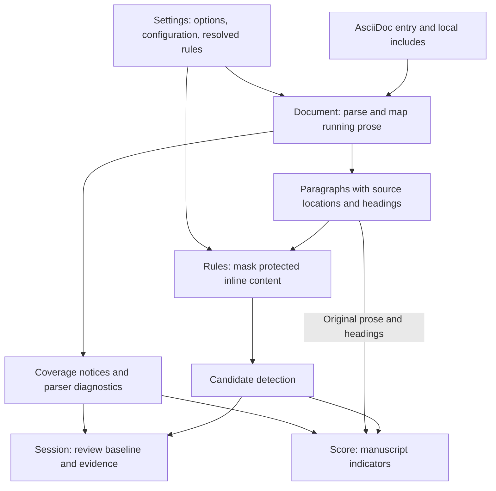
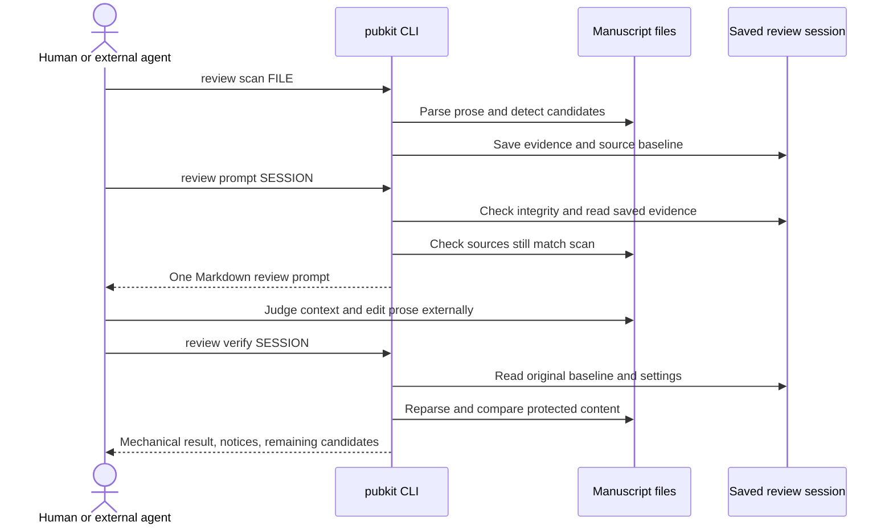
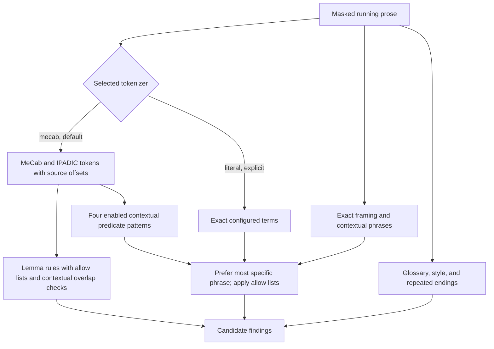
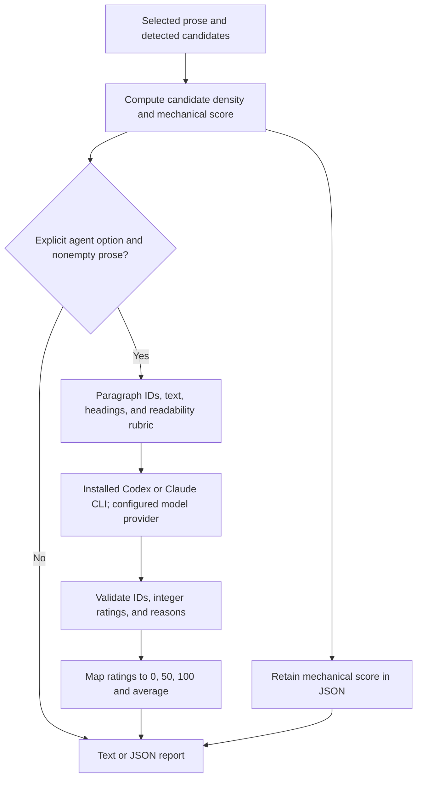

# How review and scoring work

### Features

- **Structure-aware AsciiDoc parsing.** Asciidoctor parses local includes,
  conditionals, attributes and section hierarchy before review targets are
  selected. Prose selection distinguishes paragraphs from lists, tables,
  quotations and code blocks; supported inline constructs are masked rather
  than treated as ordinary prose.
- **Separate heading and prose review.** Each scan selects one
  scope with its own rules, prompt and edit permissions. Heading review uses
  the outline and body as context while protecting body text; prose review
  protects headings. Mixed heading forms are accepted by default. See
  [Heading review](review-workflow.md#heading-review).
- **Source-aligned static analysis.** Candidates identify the original source
  file, line and one-based Unicode column, with a rule ID and review question.
  Source text is checked against parser locations; unresolved mappings produce
  coverage notices instead of guessed edit targets. Matches locate passages
  for review, not proven defects.
- **Japanese morphological analysis.** MeCab with UTF-8 IPADIC recognizes
  configured inflected predicates and adjectives, retaining original surfaces,
  dictionary forms and negative-form information in morphological prose
  findings. Literal matching is available only through explicit selection.
- **Contextual review in one prompt.** A single Markdown file carries saved
  criteria, settings, candidates and manuscript evidence. All selected prose
  paragraphs appear once, including those without candidates, with heading and
  neighboring context. The reviewer records decisions and checks meaning;
  generating the prompt does not edit the manuscript or invoke a model.
- **Book-specific rules and terminology.** Strict YAML rule sets, a glossary,
  allow lists and exclusions adapt candidate detection to the manuscript.
  Heading rules can express a book's preferred form while allowing justified
  exceptions. Resolved rules and criteria are saved with each session.
- **Baseline-based preservation checks.** Source snapshots and artifact hashes
  make the review baseline reproducible and detect stale or altered evidence.
  Verification checks protected content, source membership, structure and
  analyzer identity after external edits. It keeps `meaning_verified: false`;
  semantic correctness remains a review judgment.
- **Local analysis and distinct scoring paths.** Default analysis runs locally
  without a model call. Prose scoring reports candidate density; explicit
  `review score --agent` optionally invokes an installed Codex or Claude CLI
  for readability ratings. Candidate density, model judgments and development
  benchmark accuracy remain separate measures.

### Concept

The goal is Japanese technical prose that readers can understand, use, and
verify, with claims bounded by evidence and technical meaning preserved.
Clarity includes a paragraph's purpose, concrete operations and referents,
actors and objects, conditions and consequences, logical connections, and its
relationship to headings, figures, tables, and code. "Who does what" is one
part of that goal. Clear prose also retains precise terminology, necessary
negation, uncertainty, and implementation constraints.

The toolkit supports that goal through shared writing criteria, contextual
review prompts, source-aligned candidate detection, baseline verification,
and distinct scoring and development evaluation paths. Mechanical rules locate
passages to inspect; the reviewer judges their meaning from context and source
evidence. The writing and review prompts guide a human or external agent in
planning and revising complete paragraphs. They do not automatically reconstruct
subjects and objects or rewrite manuscripts. Model-based readability evaluation
is available only through explicit `review score --agent`.

The table identifies both implemented mechanisms and guidance carried by the
prompts. A criterion in a prompt is a review instruction, not a guarantee that
the code can detect or verify it.

| Supported principle or behavior | How it is realized | Implementation or criteria |
| --- | --- | --- |
| Write for a technical purpose and the reader's decisions | Shared criteria ask what a paragraph explains and what an engineer can decide or verify; writing prompts include those criteria | [Paragraph purpose](../data/writing/ja/criteria.md#start-with-the-paragraphs-technical-purpose), [Writing](../lib/asciidoc_pubkit/writing.rb) |
| Make actors, objects, actions, conditions, and results recoverable | Review instructions ask the reviewer to resolve omitted elements from context, while allowing unambiguous omission | [Paragraph revision](../data/writing/ja/criteria.md#revise-the-complete-paragraph), [Review prompt](../lib/asciidoc_pubkit/session.rb) |
| Replace vague abstraction, weak predicates, and metaphors with concrete explanations | Rules locate limited terms and inflected predicates; the criteria require identifying the actual referent, operation, policy, or effect before revising | [Concrete referents](../data/writing/ja/criteria.md#replace-abstraction-with-the-thing-being-discussed), [Metaphor criteria](../data/writing/ja/criteria.md#explain-metaphorical-operations-from-evidence), [Rules](../lib/asciidoc_pubkit/rules.rb) |
| Distinguish reader instructions, actual behavior, and available capabilities | The shared criteria preserve the difference between requests, automatic execution, and optional operations | [Instructions, behavior, and capabilities](../data/writing/ja/criteria.md#distinguish-instructions-behavior-and-capabilities) |
| Connect claims into coherent paragraphs | Prompts include all selected paragraphs and neighboring context; criteria require explicit referents, comparisons, causal relationships, and complete paragraph revision | [Relationships](../data/writing/ja/criteria.md#make-relationships-explicit), [Review prompt](../lib/asciidoc_pubkit/session.rb) |
| Keep claims within their evidence and preserve meaning | Review guidance asks for implementation, test, or primary-source evidence and checks omissions and unsupported additions; unresolved facts remain unresolved | [Evidence and scope](../data/writing/ja/criteria.md#keep-claims-within-their-evidence-and-purpose), [Paragraph revision](../data/writing/ja/criteria.md#revise-the-complete-paragraph) |
| Preserve technical distinctions, terminology, and justified prose choices | Criteria protect identifiers, values, conditions, negation, and necessary repetition; glossary rules, allow lists, and contextual questions support project terminology | [Terminology](../data/writing/ja/criteria.md#preserve-exact-technical-terminology), [Packaged rules](../data/review-rules.ja.yml), [Settings](../lib/asciidoc_pubkit/settings.rb) |
| Review generated-prose patterns without mechanical deletion | Framing, contextual phrases, style, and repeated-ending checks produce candidates; shared criteria reject fixed sentence-length targets and needless synonym changes | [Generated-prose patterns](../data/writing/ja/criteria.md#remove-generated-prose-patterns-without-flattening-the-meaning), [Rules](../lib/asciidoc_pubkit/rules.rb) |
| Keep headings, illustrations, tables, and code consistent with the explanation | Writing criteria address scope, comparisons, identifiers, and conceptual simplifications; review prompts constrain edits to the selected scope and protect other elements | [Headings, figures, and code](../data/writing/ja/criteria.md#headings-and-the-relation-to-figures-and-code), [Review scope](../lib/asciidoc_pubkit/session.rb) |
| Make detection traceable and coverage explicit | Asciidoctor source mapping, offset-preserving inline masking, and MeCab/IPADIC produce source-aligned evidence; ambiguous or excluded passages have coverage notices | [Document](../lib/asciidoc_pubkit/document.rb), [Morphology](../lib/asciidoc_pubkit/morphology.rb), [Rules](../lib/asciidoc_pubkit/rules.rb) |
| Preserve a reproducible and safe review baseline | Sessions save source snapshots, resolved rules, criteria, and analyzer identity; integrity checks and verification protect content outside editable prose | [Session](../lib/asciidoc_pubkit/session.rb), [Rule validation](../lib/asciidoc_pubkit/rule_set.rb) |
| Keep manuscript indicators, readability judgments, and detector accuracy distinct | Default scoring measures candidate density; optional local CLI evaluation judges readability; annotated development benchmarks measure detection and evaluate preservation separately | [Score](../lib/asciidoc_pubkit/score.rb), [Local evaluator](../lib/asciidoc_pubkit/local_evaluator.rb), [Development benchmark](../benchmark/prose.rb) |
| Make automation explicit and its limits visible | Default analysis runs locally with no model call; only explicit scoring requests invoke an external CLI. Manuscripts are not edited, and verification retains `meaning_verified: false` | [CLI](../lib/asciidoc_pubkit/cli.rb), [Local evaluator](../lib/asciidoc_pubkit/local_evaluator.rb), [Session](../lib/asciidoc_pubkit/session.rb) |

This section explains the implementation independently of command syntax.
[Review workflow](review-workflow.md#review-workflow) covers commands and session handling;
[Score an AsciiDoc manuscript](scoring.md#score-an-asciidoc-manuscript) covers scoring options.
The diagrams use GitHub-supported Mermaid fenced blocks.

### Shared components and prose selection

Both paths resolve the same settings and parse the AsciiDoc entry file with
Asciidoctor, including local includes. `Document` selects running-prose paragraphs
and maps them back to their source files. Ambiguous mappings become coverage
notices; the analyzer does not guess locations. Headings provide context, while
code, tables, quotations, lists, and protected blocks are excluded from prose
analysis. Inline code, quoted spans, links, and other protected constructs are
masked with spaces that preserve character offsets and newlines.



`Settings` resolves rule precedence as command-line `--rules`, configuration
`review.rules`, then packaged defaults. A custom rule file replaces the whole
set. `Rules` returns review candidates with one-based Unicode line and column
positions; a match does not establish a defect. `Session` saves evidence for a
later review, while `Score` returns a report directly without creating a session.
Parser diagnostics must be resolved before scanning or scoring.

### Review: collect, judge, and verify

Scanning freezes the source baseline, resolved settings and rules, analyzer
identity, and writing criteria. The session consists of `manifest.json`,
`document.json`, `findings.json`, and `baseline/`. Prompt generation checks
artifact integrity and rejects sources changed since the scan. It emits one
Markdown file containing the saved criteria, context, every selected paragraph
in document order, and its candidate evidence, including paragraphs with no
candidates. Generating that prompt requires no analyzer or model invocation.



The reviewer decides whether to keep or revise each paragraph and checks source
evidence before adding claims. `scan`, `prompt`, and `verify` never invoke an AI
CLI or edit manuscripts. Verification compares the included source set, content
outside reviewed prose, protected inline tokens, document structure, and analyzer
identity against the saved baseline. Numeric changes produce manual-review
notices; remaining candidates alone do not fail verification. A passing result
means these mechanical checks passed, with `meaning_verified: false`.

### Detection: contextual rules and token boundaries

MeCab with UTF-8 IPADIC is the default analyzer. It supplies surfaces, dictionary
forms, part of speech, and source-aligned token spans. Explicit literal mode
matches configured surface strings; there is no silent fallback. Both modes
apply glossary, configured prose style, and sentence-ending checks.



Morphological rules match configured noun and adjective lemmas, canonical verb
forms, adjacent compound nouns, and sahen nouns followed by `する` or `できる`.
Predicate spans extend through adjacent auxiliaries, dependent verbs, and
supported connective particles. Negative auxiliaries preserve polarity;
negative-only rules require that evidence. Unknown tokens are not guessed.

The four contextual patterns combine an exact prefix (`地味に`, `静かに`,
`時間を`, or `側に`) with a known independent verb lemma (`効く`, `壊れる`,
`溶かす`, or `倒す`). The canonical phrase must be enabled in the resolved rules.
For example, `地味に効かなかった` is collected as one complete candidate with
lemma `地味に効く` and `negative: true`. Protected text and paragraph boundaries
cannot bridge the pattern. Longer contextual phrases suppress contained matches,
including when the longer phrase is allowed. These limited patterns suggest
reviewing the actual effect or operation; they do not prove a metaphor is wrong.

Sentence-ending analysis splits each paragraph at `。`, `！`, and `？`, retaining
source offsets. It extracts supported endings such as `検証します` and `です`,
then checks consecutive windows of three sentences. A sentence without a matching
ending breaks the run. The first matching run produces one informational
candidate at the ending of its third sentence. Precise technical repetition may
be worth retaining; this is not a requirement to vary verbs.

### Scoring: density and optional readability judgment

Scoring first runs the shared candidate detector. For the default
`candidate-density-v1`, let `N` be all findings, including informational ones,
and `C` be non-whitespace Unicode characters after inline masking:

```text
density = N * 1000 / C
score   = max(0, 100 - 5 * density)
```

The score is rounded to three decimals. No unmasked prose yields `null`.
More candidates per 1,000 characters lower the score; short texts are particularly
sensitive. Changing rules, allow lists, or the detector can change the score of
an unchanged manuscript. This heuristic is a review indicator, not a calibrated
quality measure or a probability that AI wrote the text.



With explicit `--agent`, `llm-readability-v1` asks a fresh local CLI invocation to
rate each paragraph's sentence clarity and paragraph coherence separately from
1 to 3. The rubric targets engineers familiar with the technical terms. The
input contains paragraph IDs, original text, and headings, without candidate
findings or file paths. The CLI may connect to its configured model provider.
The response must contain every supplied ID exactly once, integer ratings in
range, and nonempty reasons. Invalid responses fail scoring.

Ratings of 1, 2, and 3 map to 0, 50, and 100. Each dimension averages equally
across scored paragraphs; the displayed score averages the two dimension means.
JSON retains both dimensions, paragraph reasons, evaluator identity, and the
mechanical score. These ordinal averages summarize a fallible judgment. There
is no reference manuscript or fact checklist in this single-document path, so
it does not assess preservation or establish technical accuracy. Temporary CLI
artifacts are removed after the invocation, and manuscripts remain unchanged.

| Result | What it measures | Evidence needed |
| --- | --- | --- |
| Candidate-density score | Detected cues per text length | Current prose and resolved rules |
| Optional readability score | Model judgment of clarity and coherence | Current prose, context, and rubric |
| Development benchmark accuracy | Detector agreement and location accuracy | Fixed corpus with annotated targets |
| Review verification | Mechanical preservation after editing | Original session baseline and current files |

See the [prose evaluation guide](prose-evaluation.md) for
before/after trials with gold targets, separate fact checklists, and evaluator
calibration. Its precision, recall, and F1 evaluate the detector rather than
providing a score for an arbitrary manuscript.

[Back to README](../README.md)
