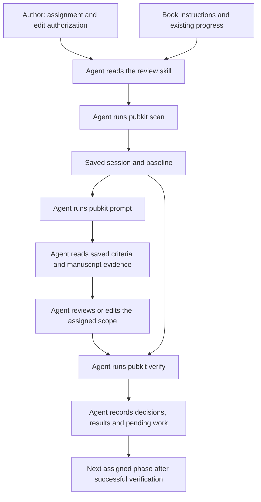

# Integrate manuscript review into an agent skill

Use the [CLI tutorial](agent-review-tutorial.md) to try individual commands first.
A skill makes the same process reusable: the agent selects the manuscript,
executes the commands, reads the generated prompt, edits within scope, verifies
and records progress. Pubkit still performs parsing and preservation checks;
it does not discover skills or launch a reviewer.

## Responsibilities



| Owner | Responsibility |
| --- | --- |
| Author and book instructions | Readers, style, technical evidence, assignment and publication decisions |
| Review skill | Scope selection, phase order, tool invocation, resumption and progress recording |
| Generated pubkit prompt | Criteria frozen at scanning, selected entries, candidates and edit permissions |
| Codex or Claude reviewer | Evidence-based decisions, authorized edits and unresolved proposals |
| Pubkit verification | Mechanical preservation against the saved baseline |

Keep shared prose and heading criteria in pubkit instead of copying them into
each skill. Skill instructions should explain when and how to use the tool,
while book instructions retain book-specific terminology and technology versions.

## A minimal reusable example

The gem includes [review-asciidoc-manuscript/SKILL.md](../examples/skills/review-asciidoc-manuscript/SKILL.md).
It is a standalone example, not an automatically installed skill. Read it before
adapting it to your project. It supports full review, single-scope review and
diagnosis without adding publication or external-message permissions.

For a project using the CyberGarage `.agents/skills` layout, copy the example to:

```text
manuscript-project/
  AGENTS.md
  book.adoc
  .agents/skills/review-asciidoc-manuscript/SKILL.md
```

Skill discovery and installation depend on your agent and project. Use the
location configured for that environment; pubkit does not install the example.
When automatic discovery is unavailable, explicitly ask Codex or Claude to read
the file and follow it. This file-based handoff needs no agent-specific CLI flags.

Example request for either reviewer:

```text
Read .agents/skills/review-asciidoc-manuscript/SKILL.md and the project's
instructions. Review book.adoc in headings, prose and supported list phases.
Use a new pass named review-book-02, preserve previous baselines and unrelated
edits, verify each phase before the next scan, and update the existing review
record. Report applied changes, reviewed/pending IDs and coverage limits.
```

For outline diagnosis only:

```text
Read .agents/skills/review-asciidoc-manuscript/SKILL.md. Diagnose book.adoc's
headings through parsed level 2 using a fresh review-toc-02 session and an outline
prompt. Do not edit the manuscript. Record title/body agreement, reading order,
keep/revise/needs-evidence decisions and separate structural proposals.
```

The agent checks the installed tool before using 1.1.0 options. A new session
does not upgrade an old baseline or certify preservation against it.

## Commands the skill orchestrates

For a heading-only assignment, the agent runs the following from the manuscript
directory, reading the prompt and completing the assigned review between prompt
and verify. Substitute unused pass names and the project's CLI invocation.

```sh
asciidoc-pubkit --version
asciidoc-pubkit review scan --help
asciidoc-pubkit review scan book.adoc --scope headings --lang ja \
  --output .pubkit/review-book-02-headings --no-input
asciidoc-pubkit review prompt .pubkit/review-book-02-headings --view outline \
  --mode revise --output .pubkit/review-book-02-headings/prompt.md
# Agent reads the prompt, records decisions and applies authorized title edits.
asciidoc-pubkit review verify .pubkit/review-book-02-headings \
  --output .pubkit/review-book-02-headings/verification-01.json
```

For a full review, proceed to fresh prose and list sessions only after the
preceding phase is finished and verifies. The [CLI tutorial](agent-review-tutorial.md#4-review-prose-then-list-text)
contains those command sequences. Do not scan all phases first: the later
baseline must capture earlier authorized edits. A pending integrity or
preservation failure blocks that phase boundary, not unrelated read-only work.

Use generated criteria rather than a second writing prompt. Keep the session's
four baseline artifacts immutable; adding prompt, decision and verification
reports beside them is permitted. Existing output files cannot be overwritten.

## The CyberGarage integration

The CyberGarage publishing repository uses
`.agents/skills/review-japanese-technical-book/SKILL.md`, backed by its
`references/review-workflow.md`. Its workflow selects the installed CLI (or
`bundle exec`), reads project-local instructions, performs separate heading,
prose and list phases, and updates each book's existing review/progress records.
The simplified example above follows those orchestration principles; it is not
a copy of that project's full book workflow.

For a book such as `books/ai/ai-orbit`, its `AGENTS.md`, `PROGRESS.md`, `PLAN.md`
and `STRUCTURE.md` determine sources, publication order and technical versions.
A chapter-limited request uses the publication entrypoint with `--only`, while
a whole-book request covers active included manuscripts without that filter.

The 1.1.0 outline view is an optional enhancement for the heading phase; it is
not a claim that an existing external skill has already been updated to use it.
This example does not change CyberGarage's skills or manuscript files. Keep
mechanical preservation, editorial completion, book build checks and publication
approval as separate recorded results.

[CLI tutorial](agent-review-tutorial.md) · [Review reference](review-workflow.md) ·
[Back to README](../README.md)
